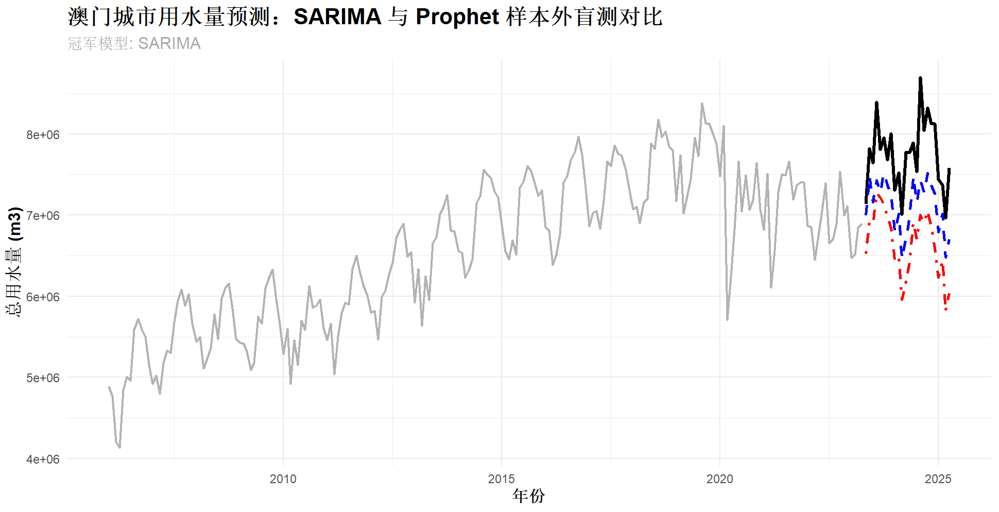

# 💧 宏观城市水务调度：智能预测与预警系统 (City Water Demand Forecasting & Scheduling)


## 📖 项目简介
本项目为城市级公共资源调度提供了一套**高度严谨的统计学与机器学习混合预测方案**。

针对“城市总用水量”这一具备强规律性、长周期的宏观时间序列数据，本项目摒弃了“无脑调用复杂模型”的做法。通过构建严格的**样本外盲测体系 (Out-of-sample Testing)**，在真实数据上对经典统计学流派（SARIMA）与现代互联网大厂开源流派（Meta Prophet）进行了深度博弈，并最终实现了从“精准预测”到“智慧水务决策”的业务落地。

---

## 🎯 核心业务价值 (Predict-then-Optimize)
在水务集团的实际运营中，高精度的宏观需水预测不仅是一个统计学指标，更是后续**运筹优化 (Operations Research)** 的前提：
1. **峰谷电价调度优化**：利用高精度预测，指导水泵机组在电价谷期（夜间）提前抽水，大幅降低水司电力成本。
2. **水库安全水位预警**：模型不仅输出点预测（Point Forecast），更输出了 **95% 置信区间 (Confidence Interval)**，为水库的“安全库容 (Safety Stock)”设定了坚实的数学边界。

---

## 🧠 硬核算法链路：从假设检验到残差诊断

本项目严格遵循了教科书级的工业建模规范，拒绝将算法作为“黑盒”使用：

### 1. 建模前传：ADF 平稳性检验 (Stationarity)
在训练前，系统自动对历史用水量序列执行了 **ADF 检验 (Augmented Dickey-Fuller Test)**。
* **发现**：$p-value > 0.05$，拒绝平稳性假设，证明城市用水量存在强烈的长期增长趋势。
* **动作**：以此为数学依据，在 SARIMA 中引入差分项 ($d > 0$) 消除非平稳趋势。

### 2. 建模后传：Ljung-Box 残差白噪声检验 (White Noise)
在模型寻优结束后，提取模型的残差进行 **Ljung-Box 检验**。
* **结论**：$p-value > 0.05$，残差序列被证实为纯随机的白噪声。
* **业务意义**：证明模型已经“彻底榨干”了数据中潜藏的所有自相关与季节性规律，处于极度健康的待部署状态。

---

## ⚔️ 巅峰对决：SARIMA 为什么碾压了 Prophet？

为了验证模型的真实泛化能力，我们扣留了最后 24 个月的真实数据作为**闭卷盲测集 (Blind Test)**。

| 排名 | 模型流派与核心架构 | 24个月盲测误差 (MAPE) | 深度洞察与反思 |
| :--- | :--- | :--- | :--- |
| 🥇 | **SARIMA (经典数理统计流派)** | **7.96%** | **完美契合宏观物理量。** 凭借强大的差分与自回归机制，极其精准地捕捉了水务数据的局部惯性与强年度季节性。 |
| 🥈 | Prophet (大厂现代拟合流派) | 13.99% | **水土不服。** 擅长处理缺失值与节假日突变的全局拟合模型，在面对平稳、强规律的宏观环境时发生了“过度平滑”，丢失了关键细节。 |

**💡 核心反思**：在真实的工业场景中，**“最新、最复杂的大厂模型”并不等于“最优模型”**。理解数据的物理特性，选择符合特定假设的数学模型，才是算法工程师的核心竞争力。

---

## 🚀 快速开始与业务交付

**1. 环境依赖:**
本项目基于 R 语言构建，依赖 `forecast`, `prophet`, `tseries` 等核心时序处理包。
```R
# 一键安装缺失依赖
if (!require("pacman")) install.packages("pacman")
pacman::p_load(tidyverse, forecast, prophet, lubridate, Metrics, ggplot2, tseries, readxl)
```

**2. 运行工业级流水线:**
直接运行 `water_forecasting.R` 脚本。系统将自动完成数据对齐、平稳性检验、参数网格搜索、残差诊断以及全要素图表绘制。

**3. 最终产出物 (Business Deliverables):**
运行结束后，根目录下将生成一份 `Macau_Water_24Months_Plan.csv` 报表。
供应链和水务调度中心**无需运行任何代码**，即可直接在 Excel 中查阅未来 24 个月的：
* 📈 **Forecast_m3** (最可能的需水推演量)
* 🛡️ **Upper_95_CI** (极端情况下需保证的最高备用水量)
* 📉 **Lower_95_CI** (保守预估最低用水量)